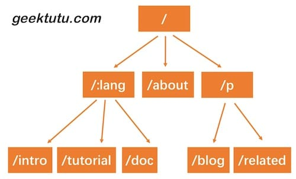

##前缀树路由
之前，我们用了一个非常简单的map结构存储了路由表，使用map存储键值对，索引非常高效，但是有一个弊端，键值对的存储的方式，只能用来索引静态路由。那如果我们想支持类似于/hello/:name这样的动态路由怎么办呢？所谓动态路由，即一条路由规则可以匹配某一类型而非某一条固定的路由。例如/hello/:name，可以匹配/hello/geektutu、hello/jack等。

动态路由有很多种实现方式，支持的规则、性能等有很大的差异。例如开源的路由实现gorouter支持在路由规则中嵌入正则表达式，例如/p/[0-9A-Za-z]+，即路径中的参数仅匹配数字和字母；另一个开源实现httprouter就不支持正则表达式。著名的Web开源框架gin 在早期的版本，并没有实现自己的路由，而是直接使用了httprouter，后来不知道什么原因，放弃了httprouter，自己实现了一个版本。

实现动态路由最常用的数据结构，被称为前缀树(Trie树)。看到名字你大概也能知道前缀树长啥样了：每一个节点的所有的子节点都拥有相同的前缀。这种结构非常适用于路由匹配，比如我们定义了如下路由规则：   
用前缀树来表示，是这样的  
/:lang/doc  
/:lang/tutorial  
/:lang/intro  
/about  
/p/blog  
/p/related  

HTTP请求的路径恰好是由/分隔的多段构成的，因此，每一段可以作为前缀树的一个节点。我们通过树结构查询，如果中间某一层的节点都不满足条件，那么就说明没有匹配到的路由，查询结束。

接下来我们实现的动态路由具备以下两个功能。  
参数匹配:。例如 /p/:lang/doc，可以匹配 /p/c/doc 和 /p/go/doc。
通配*。例如 /static/*filepath，可以匹配/static/fav.ico，也可以匹配/static/js/jQuery.js，这种模式常用于静态服务器，能够递归地匹配子路径。

对于路由来说，最重要的当然是注册与匹配了。开发服务时，注册路由规则，映射handler；访问时，匹配路由规则，查找到对应的handler。因此，Trie 树需要支持节点的插入与查询。插入功能很简单，递归查找每一层的节点，如果没有匹配到当前part的节点，则新建一个，有一点需要注意，/p/:lang/doc只有在第三层节点，即doc节点，pattern才会设置为/p/:lang/doc。p和:lang节点的pattern属性皆为空。因此，当匹配结束时，我们可以使用n.pattern == ""来判断路由规则是否匹配成功。例如，/p/python虽能成功匹配到:lang，但:lang的pattern值为空，因此匹配失败。查询功能，同样也是递归查询每一层的节点，退出规则是，匹配到了*，匹配失败，或者匹配到了第len(parts)层节点。   

